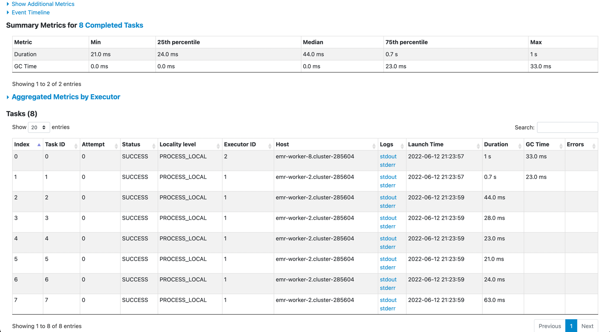

* 服务器代码存放目录: /home/student5/wusq/ch05

* 作业1：
  1. 进入/home/student5/wusq/ch05，将数据文件放入hdfs文件系统
  ```shell
  hdfs dfs -mkdir -p /user/student5/wusq/ch05/work1/data/
  hdfs dfs -put /home/student5/wusq/ch05/work1/data/* /user/student5/wusq/ch05/work1/data/
  ```
  2. 执行脚本，提交spark任务

  ```shell
  sh inverted_index.sh
  ```
  3. 执行结果
  
  

* 作业2：
  1. 进入/home/student5/wusq/ch05,将数据文件放入hdfs文件系统
  ```shell
  hdfs dfs -mkdir -p /user/student5/wusq/ch05/work2/data/
  hdfs dfs -put /home/student5/wusq/ch05/work2/data/* /user/student5/wusq/ch05/work2/data/
  ```
  2. 执行脚本，提交spark任务

  ```shell
  sh distcp.sh
  ```
    * distcp.sh脚本中指定了参数 -i -m 8 -s /user/student5/wusq/ch05/work2/data -t /user/student5/wusq/ch05/work2/data_cp
    * -i 表示忽略错误
    * -m 8 表示最大并发task数量
    * -s 表示源文件路径
    * -t 表示目标文件路径
  3. 执行结果
     * 查看/user/student5/wusq/ch05/work2/data_cp目录下和/user/student5/wusq/ch05/work2/data目录内容相同
     * 通过spark history 查看task数量正好是8个
     