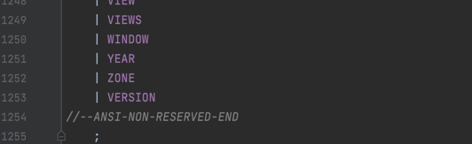

## 作业一：为 Spark SQL 添加一条自定义命令

* SHOW VERSION；
* 显示当前 Spark 版本和 Java 版本。


### 作业实现
1. 修改 spark源码文件 spark/sql/catalyst/src/main/antlr4/org/apache/spark/sql/catalyst/parser/SqlBase.g4
   * 在 `SPARK-KEYWORD-LIST` 末尾新增关键字VERSION

   
   
   * 在`statement` 尾部新增指令申明 `SHOW VERSION`

   
   * 在 `ansiNonReserved`尾部新增非保留关键字 `VERSION`

   
   * 在 `nonReserved`尾部新增非保留关键字 `VERSION`

   
2. 在spark源码sql/catalyst模块中执行命令生成代码
```shell
 mvn antlr4:antlr4
```
   * 执行命令后会在spark/sql/catalyst/target/generated-sources目录下生成对应的代码
   * 其中`SqlBaseVisitor`接口中包含了`visitShowVersion`方法声明

   
3. 修改spark源码文件 spark/sql/core/src/main/scala/org/apache/spark/sql/execution/SparkSqlParser.scala
   1. 在`SparkSqlAstBuilder`类中实现`visitShowVersion`方法
   
   ```scala
   override def visitShowVersion(ctx: ShowVersionContext): LogicalPlan = withOrigin(ctx) {
   ShowVersionCommand()
   }
   ```
   2. 在spark源码中 spark/sql/core/src/main/scala/org/apache/spark/sql/execution/command 新增scala case类ShowVersionCommand
   
   ```scala
   package org.apache.spark.sql.execution.command

   import org.apache.spark.sql.{Row, SparkSession}
   import org.apache.spark.sql.catalyst.expressions.{Attribute, AttributeReference}
   import org.apache.spark.sql.types.StringType
   
   
   case class ShowVersionCommand() extends LeafRunnableCommand {
   override val output: Seq[Attribute] =
   Seq(AttributeReference("version", StringType)())
   
   override def run(sparkSession: SparkSession): Seq[Row] = {
   val javaVersion = scala.util.Properties.javaVersion
   val scalaVersion = scala.util.Properties.versionString
   val sparkVersion = sparkSession.version
   
       val output = s"Java version: $javaVersion " +
         s"Scala version: $scalaVersion " +
         s"Spark version: $sparkVersion"
       Seq(Row(output))
   }
   }
   ```
4. 在命令行中通过maven命令编译源码
```shell
  mvn clean package -DskipTests -pl sql/hive-thriftserver -am -Phive-thriftserver 
```
5. 执行
```shell
./bin/spark-sql

show version;
```
6. 执行结果

   